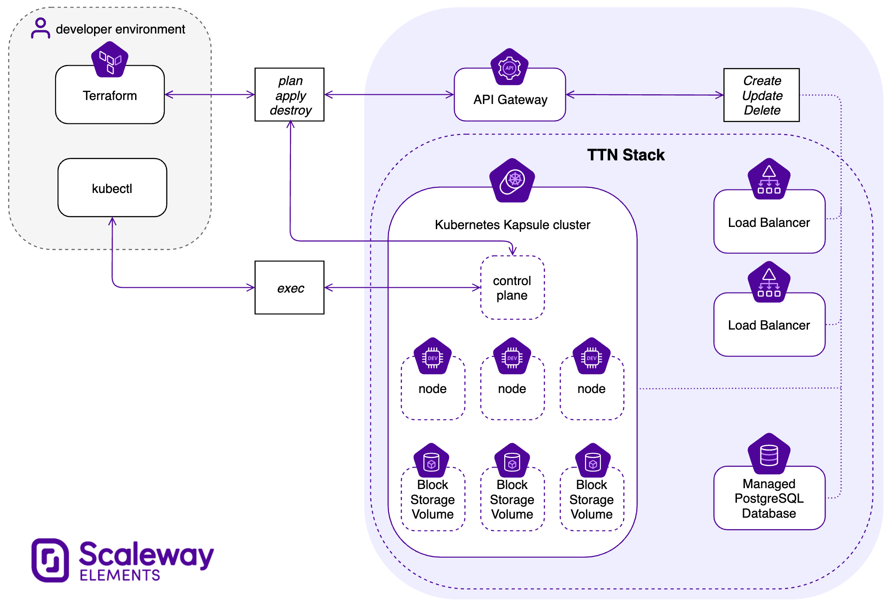
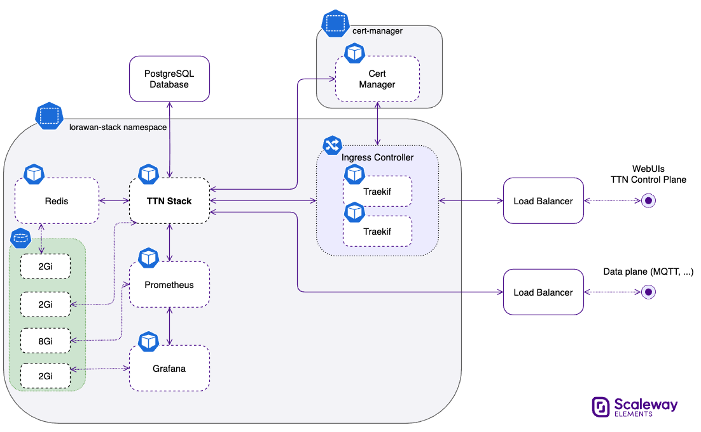

# The Things Network LoRaWAN stack deployment

## How to use

### Prerequisites

You'll need:
- A Scaleway account to deploy the stack to
- Terraform & kubectl installed locally
- A domain name

### What will happen

The following resources will be created:
- RDB instance
- Kapsule cluster
- Load Balancer
- Two block Storages of 2GB each



### Setting up environment

1. Configure Terraform Provider authentication with Scaleway credentials: [https://registry.terraform.io/providers/scaleway/scaleway/latest/docs#authentication](https://registry.terraform.io/providers/scaleway/scaleway/latest/docs#authentication)
1. Clone this repository

### Installing

1. Initialize terraform states with `tf init`
1. Deploy terraform resources with `tf apply`
1. Configure the following files with your mail/FQDN/etc.:
   - manifests/ttn-stack/ttn-lw-stack-docker.yaml
   - manifests/ttn-stack/ingress.yaml
   - manifests/cert-manager/cert-issuer.yaml
   - manifests/grafana/ingress.yaml
1. Import the generated kubeconfig file with `export KUBECONFIG=$(pwd)/kubeconfig`
1. Deploy the cert-manager with `kubectl apply -f manifests/cert-manager`
1. Deploy TTN stack with `kubectl apply -k manifests`.
	The configuration will give something similar to the following diagram:


1. Get the `traefik-ingress-lb` Load Balancer IP address and create a `type A` DNS zone with your domain name:
```
$> kubectl -n lorawan-stack get svc
NAME                       TYPE           CLUSTER-IP      EXTERNAL-IP      PORT(S)                                                                                                                                                                AGE
grafana                    ClusterIP      10.35.59.46     <none>           3000/TCP                                                                                                                                                               2h
prometheus                 ClusterIP      10.33.18.74     <none>           80/TCP                                                                                                                                                                 2h
redis                      ClusterIP      10.37.55.243    <none>           6379/TCP                                                                                                                                                               2h
traefik-api                ClusterIP      10.47.92.232    <none>           8080/TCP                                                                                                                                                               2h
traefik-ingress-lb         LoadBalancer   10.44.140.93    51.158.131.XXX   80:31446/TCP,443:30103/TCP                                                                                                                                             2h
ttn-lw-stack               LoadBalancer   10.46.112.10    51.158.130.XXX   1881:32410/TCP,8881:31367/TCP,1882:32002/TCP,8882:30789/TCP,1883:31411/TCP,8883:31264/TCP,1884:32587/TCP,8884:32385/TCP,8886:31414/TCP,1887:32745/TCP,8887:31778/TCP   2h
ttn-lw-stack-semtech-fwd   NodePort       10.33.146.181   <none>           1700:30217/UDP                                                                                                                                                         2h
ttn-lw-stack-web           ClusterIP      10.45.165.166   <none>           80/TCP,443/TCP                                                                                                                                                         2h
```
Here is what the A field would look like: ```ttn 60 IN A 51.158.131.XXX```

1. Execute the following commands and do not forget to replace `ttn-lw-stack-xxxxxxxxxxx-xxxx` with your pod and `your-email@tld.com` with your email:

```
$> kubectl get pods -n lorawan-stack
NAME                            READY   STATUS    RESTARTS   AGE
redis-cc5fcd64f-5gsr6           1/1     Running   0          2m43s
ttn-lw-stack-xxxxxxxxxxx-xxxx   1/1     Running   1          2m40s
```


```
$> kubectl exec -ti -n lorawan-stack ttn-lw-stack-xxxxxxxxxx-xxxxx -- ttn-lw-stack is-db create-admin-user \
--id admin \
--email your-email@tld.com
```

```
$> kubectl exec -ti -n lorawan-stack ttn-lw-stack-xxxxxxxxxx-xxxxx -- ttn-lw-stack is-db create-oauth-client \
 --id cli \
 --name "Command Line Interface" \
 --owner admin \
 --no-secret \
 --redirect-uri "local-callback" \
 --redirect-uri "code"
```

```
$> CONSOLE_SECRET="your-console-secret"
$> SERVER_ADDRESS="your-server-address"
$> kubectl exec -ti -n lorawan-stack ttn-lw-stack-xxxxxxxxxx-xxxxx -- ttn-lw-stack is-db create-oauth-client \
  --id console \
  --name "Console" \
  --owner admin \
  --secret "${CONSOLE_SECRET}" \
  --redirect-uri "${SERVER_ADDRESS}/console/oauth/callback" \
  --redirect-uri "/console/oauth/callback" \
  --logout-redirect-uri "${SERVER_ADDRESS}/console" \
  --logout-redirect-uri "/console"
```


### Using

A lorawan-stack namespace have been created, and contains a LoadBalancer resource
which you can contact to access the ttn-lw stack software.
See https://www.thethingsindustries.com/docs/getting-started/ for more documentation.

## How it works

The repository looks something like this:

```
.
├── README.md
├── main.tf
├── manifests
│   ├── kustomization.yaml
│   ├── cert-manager
│   │   └── *.yaml
│   ├── redis
│   │   └── *.yaml
│   ├── traefik
│   │   └── *.yaml
│   ├── ttn-lw-stack-docker.yaml
│   └── ttn-stack
│       └── *.yaml
├── providers.tf
└── versions.tf
```

When calling `tf init`, terraform gets the necessary plugins, and creates the
base state files.  After, calling the `tf apply` uses mainly `main.tf` which
creates the infrastructure resources (RDB instance, Kapsule cluster). It also
saves the kubeconfig file in the root folder of the git repository and creates
the necessary namespaces in the cluster.

The cluster bootstrap is done in two stages:
- Installation of the dependencies:
  o cert-manager for certificates management
  o traefik as kubernetes ingress controller
  o redis for storage and caching
- Installation of TTN stack

## Contributors

<table>
<tr>
	<td align="center"><a href="https://twitter.com/didjcodt"><br /><sub><b>Clément Decoodt</b></sub></a><br /><a href="https://github.com/didjcodt/" title="Code">💻</a>
	</td>
<td align="center"><a href="https://twitter.com/luisomoreau"><br /><sub><b>Louis MOREAU</b></sub></a><br /><a href="https://github.com/luisomoreau" title="Code">💻</a></td>
</tr>
</table>

Feel free to submit a Pull Request and don't forget to add you name and your useful links.

## Contributing

See Scaleway contributing guide or ping @didjcodt on [Scaleway's Slack community](https://slack.scaleway.com/)
